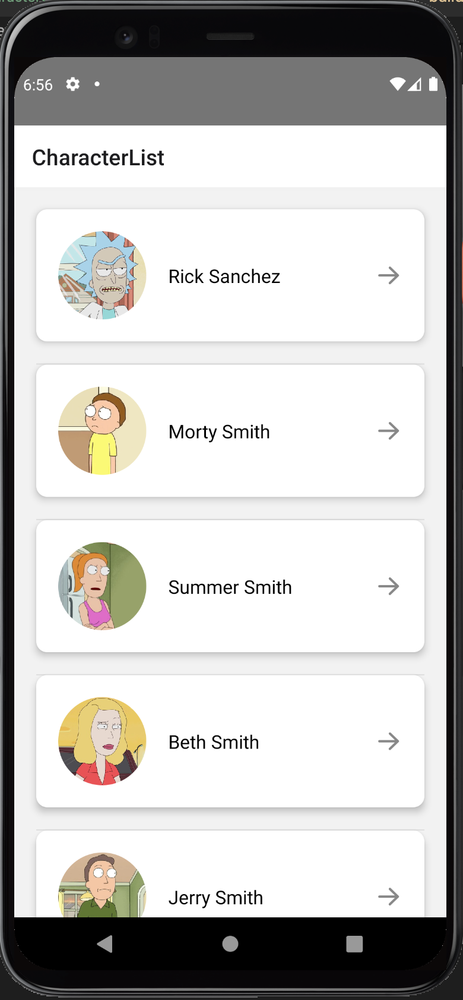
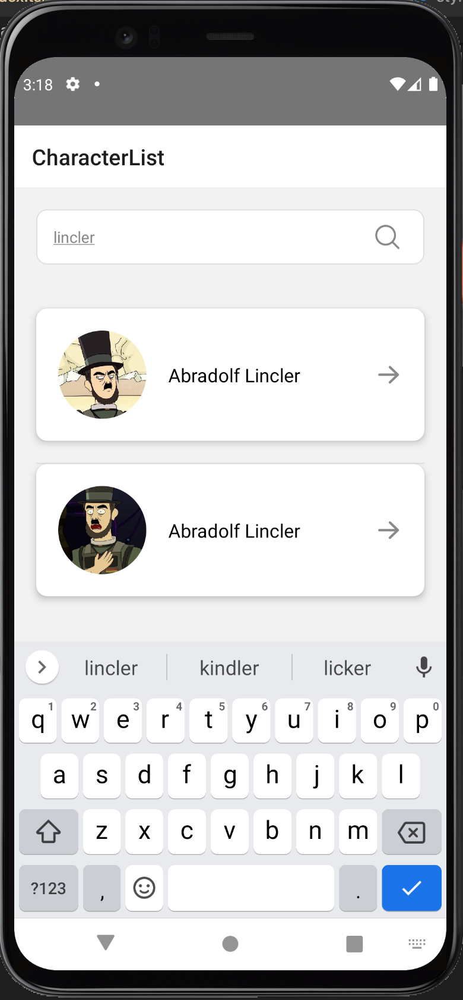
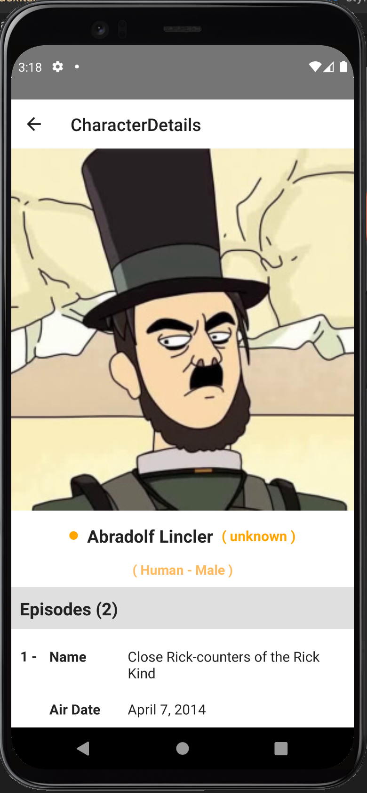

# Yas
## Main technologies used
- React Native
- Typescript
- React Navigation 
- Graphql
- Apollo Client
- React Native Testing Library

## Main functionality

- Home Page contain list of characters.
- User can scroll with pagination through the character list 
- User can search by writing the name inside Search box and if there are result it will appear or it will view no result message.
- User can see all the details related to the character by click on the character card.

## Prerequisites

- React Native CLI to be installed. You can install it by running the command:

`npm install -g react-native-cli`

- Simulator or emulator to run the app on.

### Installation

First clone the repo using `SSH` or `HTTPS`.
Here's an example using `HTTPS`:

`git clone https://github.com/MMelek00/Yas.git`

Second run the following command to install project dependencies:

`yarn install`

**in IOS**

You will need to make one more step to install pods dependencies, run the following command in the project directory:

- `cd ios && pod install`

### Run on Device

- run `yarn android` or `yarn ios` to run on device or emulator.

### Run Unit Test

- run `yarn run test` to run all unit test suites.

## Screenshots

  
  
  

